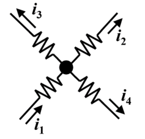
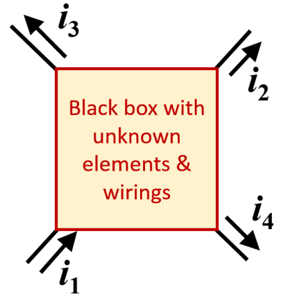
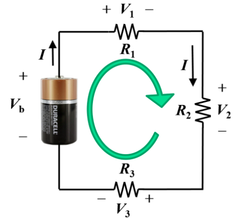
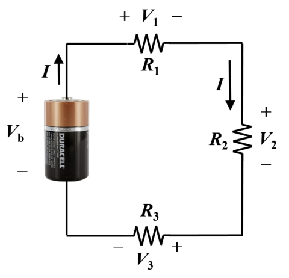
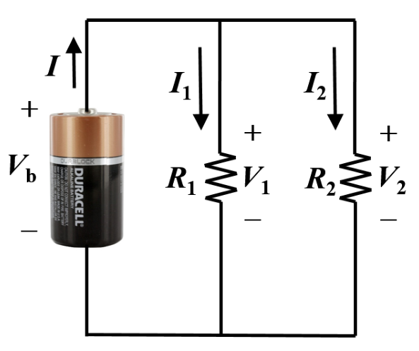
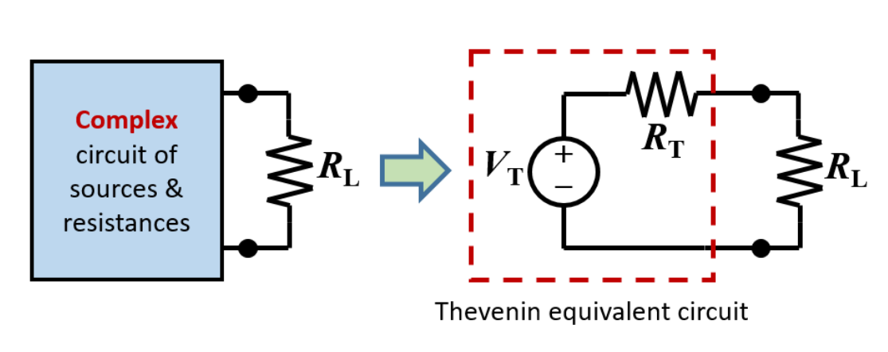
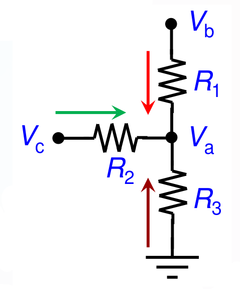

# Computer Engineering Principles and Practice I

# 1. Fundamentals of Electricity

## 1.1 Electrical Quantities
### Electrical quantities

| Quantity | Description |
| ----- | ----- |
| Electric charge | The physical property of matter that causes it to experience a force when placed in an electromagnetic field The charge carried by an electron: $$q_e=-16.02\times10^{-19}\text{ C}$$ In a conductor, electrons move under the influence of an electric field, giving rise to an electric current opposite to the flow of electrons. |
| Voltage | It is a measure of the **energy transferred per unit charge** when the charge is moved from one point to another point Unit of voltage: Volt (V) $$V = \frac{E}{Q}$$ Also called electromotive force (EMF) The ‘+’ terminal is at a higher energy level than the ‘-’ terminal. |
| Electric Current | The time rate of flow of electrical charges through an element Unit: Ampere (A) $$I = \frac{Q}{t}$$ Electric current has a direction, and it is the direction of flow of positive charges. |
| Electric Power | Rate of energy transfer. $$\text{P}=\text{V}\times I = \frac{E}{q}\times\frac{q}{t} = \frac{V^2}{R}=I^2R$$ |
| Resistance and Ohm’s law | When electric current flows through a wire or other circuit elements, it encounters some opposition. $$V= I\times R$$ Ohm’s Law states that the voltage across an ideal resistor is proportional to the current through it. Ohm’s law is an empirical relationship which can be observed, but it is also an approximation It does not hold at very high or low voltage and current values. Resistance also depends on the material and geometry of the element. $$R=\rho \frac{L}{A}$$ |
| Active Element (Source) | If a positive charge enters the negative polarity and exits the positive polarity of an element. The charge gains energy from the element. The element is a source (active element). |
| Passive Element (Load) | If positive charge enters the positive polarity and exits the negative polarity of an element. The charge loses energy in the element The element is a “load” (passive element) |

### Power Loss

* When current flows through resistance, charged particles lose energy to the element, which results in a voltage drop. The energy loss also heats up the element. Hence power loss is given by the formula:  
* $P_L = V\times I = \left(I\times R\right) \times I = I^2 R$	  
* Hence,  
* $P_L\propto I^2$

### Internal Resistance
* In reality, batteries have an internal resistance. There will be a voltage drop across this internal resistance. The higher the load current, the higher the voltage drop and the higher the power loss.
$$V = V_{total} - i_L R_{i}$$
* Wires must have sufficient thickness.
* Recalling the resistivity v/s resistance formula, as the cross sectional area increases, resistance decreases, and power loss decreases for the same current.
    * e.g. Jumper cables for jump-starting cars are very thick because of their high current. If they were done with breadboard wires, the wires would melt.

## 1.2 Kirchhoff's Current and Voltage Laws 

### Kirchhoff's Current Law
The sum of all currents entering a node is equal to the sum of all currents leaving a node.
* This is based on the *conservation of charges*.
* Current = Flow of charges
    * $I=\frac{Q}{t}$
* Since charges cannot be created nor destroyed, net flow of charges into or out of a node must be 0 (See figure 1.2.1).

    <figure>
        
    </figure>

$$\text{Figure 1.2.1:}\quad  i_1 = i_2 + i_3 + i_4$$

KCL can be applied to a supernode, which is any enclosed portion of the circuit. We visualise this as a black box with unknown elements and wirings.

    <figure>
        
    </figure>

$$\text{Figure 1.2.2:}\quad  i_1 = i_2 + i_3 + i_4$$

### Kirchhoff's Voltage Law
Around any closed loop, the sum of voltage rises is equal to the sum of voltage drops.
* This is derived from the conservation of power.
* Voltage rises when we go from negative to positive polarity.
* Voltage drops when we go from positive to negative polarity.
    * $V_b =V_1+V_2+V_3$  (see Figure 1.2.3)

    <figure>
        
    </figure>

$$\text{Figure 1.2.3:}\quad  V_b = V_1 + V_2 + V_3$$

Derivation:
* Total power consumed by resistors:
    * $V_1I + V_2I+V_3I=I(V_1+V_2+V_3)$
* Power supplied by battery:
    * $P = V_bI$
* By conservation of power,
$$V_b = V_1 + V_2 + V_3$$

## 1.3 Resistances in Series and Parallel
### Resistance in Series
* From KCL, we know that currents in all resistors in series is identical.
* From KVL and Ohm's law,
$$
\begin{array}{rcl}
    V_b & = & V_1+ V_2+V_3 \\
    & = & IR_1+IR_2+IR_3 \\
    & = & I\cdot(R_1+R_2+R_3)\\
\end{array}
$$
* Since $V_b = IR_b$ ,
$$R_b=R_1+R_2+R_3$$
Resistances in series sum up to resistance in series.

### Resistance in Parallel
* $V_b=V_1=V_2=V_3$
* From KCL,
$$
\begin{array}{rcl}
I&=&I_1+I_2+I_3\\
&=&\frac{V_b}{R_1}+\frac{V_b}{R_2}+\frac{V_b}{R_3}\\
&=&V_b\left(\frac{1}{R_1}+\frac{1}{R_2}+\frac{1}{R_3}\right)
\end{array}
$$
* Since $I=\frac{V_b}{R_{eq}}$, we have:
$$R_{eq}=\frac{1}{R_1}+\frac{1}{R_2}+\frac{1}{R_3}$$
* Since $\frac{1}{R_{eq}}>R_i$ for any $i=1,2,3,\cdots$, $\quad\therefore R_{eq}<R_i$ .
* Resistors in parallel result in reduced resistance.

## 1.4 Voltage Division Principle
In series circuit, the voltage across each resistance is a fraction of the total voltage, equal to the ratio of the concerned resistance to the total resistance

    <figure>
        
    </figure>

$$\text{Figure 1.4.1}$$

$$

\begin{array}{rcccl}
I & = & \displaystyle\frac{V_b}{R_1+R_2+R_3}&& \\
V_1 & = & I\times R_1&=&\displaystyle \frac{R_1}{R_1+R_2+R_3}\cdot V_b \\[10pt]
V_2 & = & I\times R_2&=&\displaystyle \frac{R_2}{R_1+R_2+R_3}\cdot V_b \\[10pt]
V_3 & = & I\times R_3&=&\displaystyle \frac{R_3}{R_1+R_2+R_3}\cdot V_b \\
\end{array}
$$

## 1.5 Current Division Principle
For two resistances in parallel, the current flowing in each resistance is a fraction of the total current, equal to the ratio of the other resistance to the sum of both the resistances

    <figure>
        
    </figure>

$$\text{Figure 1.5.1.}$$
$$
\begin{array}{rcl}
V_b&=&\displaystyle(R_1||R_2)\cdot I=\frac{R_1R_2}{R_1+R_2}\cdot I\\[10pt]
I_1&=&\displaystyle\frac{V_1}{R_1}=\frac{V_b}{R_1}=\frac{R_1}{R_1+R_2}\cdot I\\[10pt]
I_1&=&\displaystyle\frac{R_1}{R_1+R_2}\cdot I
\end{array}
$$

---

# 2. Thevenin Equivalent Circuit

The Thevenin equivalent circuit replaces any linear two-terminal network with an equivalent circuit consisting of a single voltage source, $V_{th}$, in series with a resistance, $R_{th}$. The equivalent circuit produces the same terminal voltage and current for any connected load.

## 2.1 Concept of Thevenin Equivalent Circuit
The equivalent circuit is called a “Thevenin equivalent circuit” if it consists of just an ideal voltage source and a series resistance
* Ideal voltage source called “Thevenin voltage” (VT)
* Series resistance called “Thevenin resistance” (RT)

    <figure>
        
    </figure>

$$\text{Fig 2.1.1:}
\quad V_{th}\text{ in series with }R_{th}$$

### Steps to finding the Thevenin Equivalent

1. **Remove the load** from the two terminals of interest.
2. Find the **Thevenin voltage**, $V_{th}$, as the open-circuit voltage across the terminals:
   $$V_{th}=V_{oc}$$
3. Find the **Thevenin resistance**, $R_{th}$:
   * Deactivate independent sources: replace ideal voltage sources with short circuits and ideal current sources with open circuits.
   * Find the equivalent resistance looking into the terminals.
   $$R_{th}=R_{eq}\text{ (with independent sources deactivated)}$$
4. Connect the load back to the Thevenin equivalent.

For a load resistance $R_L$, the load current and voltage are:
$$I_L=\frac{V_{th}}{R_{th}+R_L}$$
$$V_L=I_LR_L=\frac{R_L}{R_{th}+R_L}V_{th}$$

If dependent sources are present, they must remain active; $R_{th}$ can be found using a test voltage or current source:
$$R_{th}=\frac{V_{test}}{I_{test}}$$

Thevenin's theorem is useful because it simplifies a complex circuit into a form that makes load-current and load-voltage calculations straightforward.

# 3. Circuit Analysis Techniques
## 3.1 Polarity
To find the unknown voltages and currents for various elements in the circuit. We need to find the voltage polarity and current direction, not just their magnitudes!
### Reference Directions for Current
We assign (assume) a reference direction for the unknown current in each branch. After solving the circuit, the current may be positive or negative.
* If positive,
    * The actual current is in the same direction as the
reference direction
* If negative,
    * The actual current is in the opposite direction of the
reference direction
### Reference Directions for Voltage
We assign (assume) a reference polarity for the unknown voltage across each element. After solving the circuit, the voltage may be positive or negative
* If positive,
    * The actual voltage polarity is in the same direction as the reference polarity
* If negative,
    * The actual voltage polarity is in the opposite direction of the reference polarity

## 3.2 Passive and Active elements

**Passive elements** consume power: voltage (potential) drops in the direction of the current, e.g.,
- Resistors
- Batteries being recharged

**Active elements** deliver power: voltage (potential) rises in the direction of the current.
- A DC power supply that is delivering current to some resistors

### Passive Sign Convention
* Adopted when it is not clear whether an unknown element is active or passive
* Assumes all unknown elements are passive
    * Reference direction for current is always assumed to enter the positive voltage terminal of the element
* Significance:
    * If power is calculated to be positive, the element is passive (a load)
    * If power is calculated to be negative, the element is active (a source)

## 3.3 Node Voltage Analysis

* Most general method for analysing circuits.
* Basic idea
    * Solve for unknown node voltages w.r.t. a *reference node*.
    * Use them to calculate the voltage across any element, & the current passing through it.

### Steps for NVA
1. Select a reference node (usually a ground terminal)
2. For each voltage source connected to the reference node, the other end's node is a known constant.
3. For all other voltage sources, one end’s node voltage can be written in terms of the other end’s node voltage. So there is at most one unknown variable for each such voltage source.
    * *If there are known voltages in place of unknowns, you can express them as constants too instead of variables.* 
4. Define the remaining node voltages as unknown variables.
5. Apply KCL at the nodes, to obtain as many equations as the number of unknown variables.
    * Express each current in a resistive branch in terms of the adjacent node voltages (using Ohm’s law).

    <figure>
        
    </figure>

$$\text{Fig 3.3.1. junction } V_a \text{, at which NVA is done}$$

$$\frac{V_b-V_a}{R_1}+\frac{V_c-V_a}{R_2}+\frac{0-V_a}{R_3}=0$$

# 4. Capacitors

## 4.1 Capacitance
## 4.2 Capacitance in Series and Parallel
## 4.3 Capacitor Equations
## 4.4 DC Transients
# 5. Inductors
## 5.1 Faraday's Law
## 5.2 Inductance in Series and Parallel
## 5.3 Energy Storage
## 5.4 Inductor's Transient Current
# 6. AC Circuits
## 6.1 Root-Mean-Square (RMS)
## 6.2 Phase Difference
## 6.3 Complex Domain (j), Phasors
## 6.4 Impedance of Inductors, Capacitors and resistors
## 6.5 AC Circuit Analysis with Phasors and Impedances 
